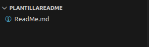

# Nombre del proyecto 
### _Nombre del repositorio_ 🚀

#### ✅ Descripcion del proyecto:
Escribir aqui una breve descripción del proyecto (Qué hace y para qué sirve)

## 👾 *Como iniciar con el proyecto*
1. Crear un directorio especifico para el proyecto
2. Clonar el repositorio en el direcotrio especificado:
```bash
git clone https://github.com/Anderson-Oloroso/MiRepositorio.git
```
3. Abrir el proyecto

## 👾 *Archivos del proyecto*
Puede ser directamente la estructura o solo una imagen del visor de archivos



## 💻 *Lenguaje de programación utilizado*
- 🐍 Python
- ☕ Java
- 📊 SQL

## 👤 _Creador(es)_
#### *Nombre:* <u>Henrik Anderson Oloroso García</u>
##### *Fecha de creación:* <u>[Fecha]</u>

¡Gracias por utilizar mi programa! 
